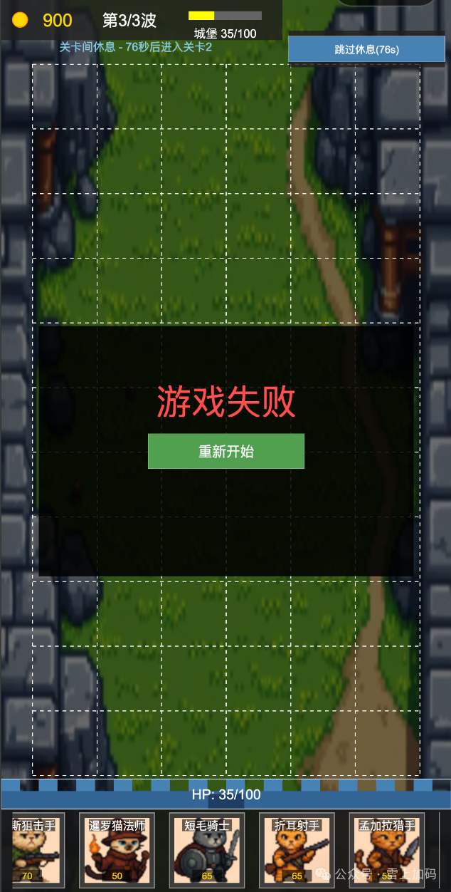
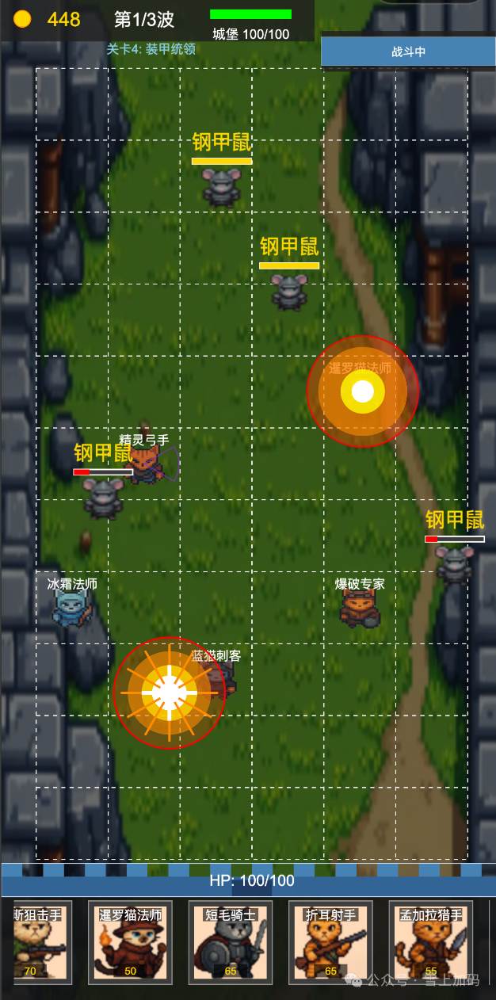
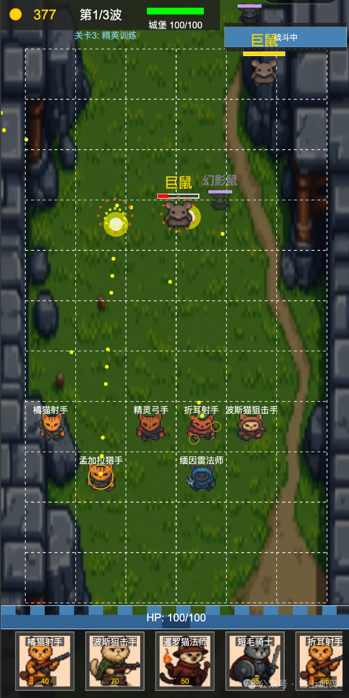
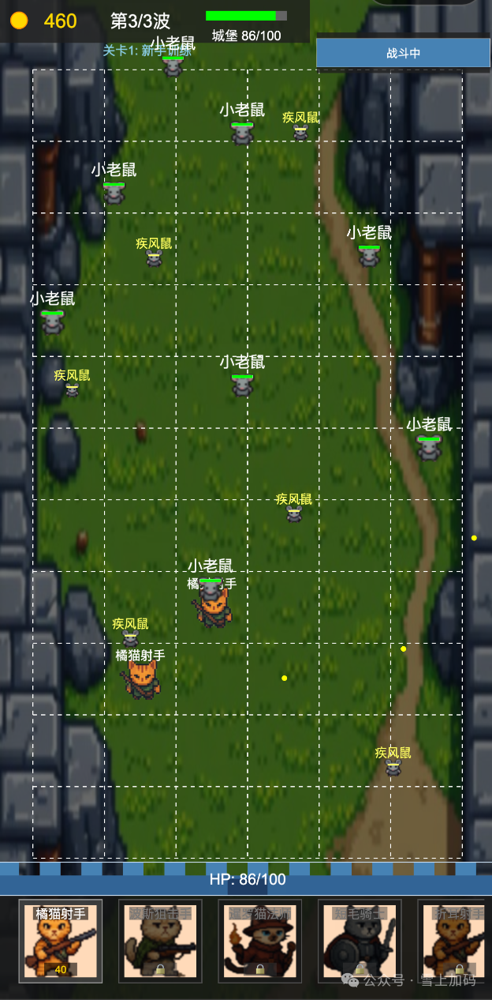

# CatProtectPlanMingame 🐱🏰

[English](#english) | [中文](#中文)

---

## English

### 🎮 Game Overview

**CatProtectPlanMingame** is a tower defense game built with **Cocos Creator 3.8.6** and **TypeScript**. Deploy various cat heroes to defend your castle against waves of mouse enemies!

#### ✨ Key Features

- **11 Unique Cat Heroes** - From Orange Cat Archers to Scottish Marksmen
  - 8 Ranged Heroes (Physical & Magic shooters)
  - 3 Melee Heroes (Knights & Assassins)
- **16 Enemy Types** - Including 7 challenging Boss enemies
- **10 Progressive Levels** - Unlock all heroes in first 3 levels, face unique bosses in remaining 7
- **Unified Projectile System** - All heroes attack using projectiles (bullets, magic missiles, shockwaves)
- **Pure Tower Defense Mechanics** - Heroes never die, enemies never attack heroes

### 📸 Game Screenshots

<div align="center">

| Battle with Armored Mouse | Boss Battle - Giant Mouse |
|:---:|:---:|
|  |  |
| *Deploy heroes to fight armored mice* | *Epic boss battle with giant mouse* |

| Early Wave Combat | Hero Selection |
|:---:|:---:|
|  |  |
| *Basic enemies - mice and speed rats* | *Choose your heroes strategically* |

</div>

<div align="center">

### 🎮 Try it Now!


**Scan to play on WeChat Mini Program**

</div>

### 🚀 Quick Start

#### Prerequisites

- **Cocos Creator 3.8.6** (Required)
- Node.js v16+ (Recommended)

#### Installation

1. Clone the repository
```bash
git clone https://github.com/yourusername/CatProtectPlanMingame.git
cd CatProtectPlanMingame
```

2. Open the project
   - Launch **Cocos Creator 3.8.6**
   - Click "Open Project"
   - Select the project directory

3. Run the game
   - Click the **Preview** button in the toolbar
   - Or press `Ctrl/Cmd + P`

### 📁 Project Structure

```
assets/
├── scripts/              # TypeScript source code
│   ├── components/       # Game components
│   │   ├── heroes/      # 11 hero types
│   │   ├── enemies/     # 16 enemy types
│   │   ├── game/        # Game objects (Castle)
│   │   └── ui/          # UI components
│   ├── managers/        # Game managers
│   ├── projectiles/     # Projectile system
│   ├── systems/         # Core systems
│   ├── types/           # Type definitions
│   └── utils/           # Utility functions
├── resources/           # Game resources
│   └── images/         # Sprites and icons
└── scenes/             # Game scenes
```

### 🛠️ Tech Stack

- **Engine**: Cocos Creator 3.8.6
- **Language**: TypeScript (Strict mode)
- **Architecture**: Component-based architecture
- **Design Patterns**: Factory, Singleton, Object Pool
- **Target Platforms**: Web, Mobile

### 🎯 Game Mechanics

#### Heroes
Heroes are permanent defensive units that:
- Deploy on an 11x6 grid
- Attack enemies using projectiles
- Never die or take damage
- Have unique abilities and attack patterns

#### Enemies
Enemies focus on breaking through defenses:
- Move towards the castle
- Damage the castle upon arrival
- Have various abilities (armor, stealth, summoning)
- **Never attack heroes** (pure tower defense)

#### Victory & Defeat
- **Victory**: Survive all waves in a level
- **Defeat**: Castle health reaches zero
- On defeat, game resets to Level 1

### 📚 Documentation

- [Development Guide](./CLAUDE.md) - Comprehensive development documentation
- [Component Architecture](./COMPONENT_ARCHITECTURE.md) - System architecture
- [Game Mechanics Design](./docs/GameMechanicsDesign.md) - Detailed game design
- [Game Balance Design](./GAME_BALANCE_DESIGN.md) - Balance and difficulty

### 🤝 Contributing

Contributions are welcome! Please read our [Contributing Guide](./CONTRIBUTING.md) first.

1. Fork the repository
2. Create your feature branch (`git checkout -b feature/AmazingFeature`)
3. Commit your changes (`git commit -m 'Add some AmazingFeature'`)
4. Push to the branch (`git push origin feature/AmazingFeature`)
5. Open a Pull Request

### 📝 License

This project is licensed under the MIT License - see the [LICENSE](./LICENSE) file for details.

### 🙏 Acknowledgments

- Built with [Cocos Creator](https://www.cocos.com/creator)
- Developed with assistance from Claude AI
- Special thanks to all contributors

### 📮 Contact

- Issues: [GitHub Issues](https://github.com/yourusername/CatProtectPlanMingame/issues)
- Discussions: [GitHub Discussions](https://github.com/yourusername/CatProtectPlanMingame/discussions)

---

## 中文

### 🎮 游戏概述

**CatProtectPlanMingame** 是一款使用 **Cocos Creator 3.8.6** 和 **TypeScript** 开发的塔防游戏。部署各种猫咪英雄，保护城堡抵御一波波的鼠群攻击！

#### ✨ 核心特色

- **11种独特的猫咪英雄** - 从橘猫射手到苏格兰折耳猫射手
  - 8种远程英雄（物理和魔法射手）
  - 3种近战英雄（骑士和刺客）
- **16种敌人类型** - 包含7种具有挑战性的BOSS敌人
- **10关渐进解锁系统** - 前3关解锁所有英雄，后7关面对独特BOSS
- **统一投射物系统** - 所有英雄都使用投射物攻击（子弹、魔法弹、冲击波）
- **纯塔防机制** - 英雄永不死亡，敌人永不攻击英雄

### 📸 游戏截图

<div align="center">

| 对战钢甲鼠 | BOSS战：巨鼠 |
|:---:|:---:|
|  |  |
| *部署英雄对抗钢甲鼠群* | *史诗级巨鼠BOSS战* |

| 早期波次战斗 | 英雄选择 |
|:---:|:---:|
|  |  |
| *基础敌人 - 小老鼠和疾风鼠* | *策略性选择你的英雄* |

</div>

<div align="center">

### 🎮 立即试玩！


**扫码体验微信小程序**

</div>

### 🚀 快速开始

#### 环境要求

- **Cocos Creator 3.8.6**（必需）
- Node.js v16+（推荐）

#### 安装步骤

1. 克隆仓库
```bash
git clone https://github.com/yourusername/CatProtectPlanMingame.git
cd CatProtectPlanMingame
```

2. 打开项目
   - 启动 **Cocos Creator 3.8.6**
   - 点击"打开项目"
   - 选择项目目录

3. 运行游戏
   - 点击工具栏的**预览**按钮
   - 或按 `Ctrl/Cmd + P`

### 📁 项目结构

```
assets/
├── scripts/              # TypeScript源代码
│   ├── components/       # 游戏组件
│   │   ├── heroes/      # 11种英雄类型
│   │   ├── enemies/     # 16种敌人类型
│   │   ├── game/        # 游戏对象（城堡）
│   │   └── ui/          # UI组件
│   ├── managers/        # 游戏管理器
│   ├── projectiles/     # 投射物系统
│   ├── systems/         # 核心系统
│   ├── types/           # 类型定义
│   └── utils/           # 工具函数
├── resources/           # 游戏资源
│   └── images/         # 精灵图和图标
└── scenes/             # 游戏场景
```

### 🛠️ 技术栈

- **引擎**: Cocos Creator 3.8.6
- **语言**: TypeScript（严格模式）
- **架构**: 组件化架构
- **设计模式**: 工厂模式、单例模式、对象池
- **目标平台**: Web、移动端

### 🎯 游戏机制

#### 英雄系统
英雄是永久性防御单位，特点是：
- 部署在11x6网格上
- 使用投射物攻击敌人
- 永不死亡或受到伤害
- 拥有独特能力和攻击模式

#### 敌人系统
敌人专注于突破防线：
- 向城堡移动
- 到达城堡后造成伤害
- 拥有各种能力（护甲、潜行、召唤）
- **永不攻击英雄**（纯塔防机制）

#### 胜利与失败
- **胜利**: 在关卡中生存所有波次
- **失败**: 城堡生命值降至零
- 失败后，游戏重置至第1关

### 📚 文档

- [开发指南](./CLAUDE.md) - 完整的开发文档
- [组件架构](./COMPONENT_ARCHITECTURE.md) - 系统架构说明
- [游戏机制设计](./docs/GameMechanicsDesign.md) - 详细的游戏设计
- [游戏平衡设计](./GAME_BALANCE_DESIGN.md) - 平衡性和难度设计

### 🤝 贡献

欢迎贡献！请先阅读我们的[贡献指南](./CONTRIBUTING.md)。

1. Fork 本仓库
2. 创建您的特性分支 (`git checkout -b feature/AmazingFeature`)
3. 提交您的更改 (`git commit -m 'Add some AmazingFeature'`)
4. 推送到分支 (`git push origin feature/AmazingFeature`)
5. 打开一个 Pull Request

### 📝 许可证

本项目采用 MIT 许可证 - 详见 [LICENSE](./LICENSE) 文件。

### 🙏 致谢

- 使用 [Cocos Creator](https://www.cocos.com/creator) 构建
- 在 Claude AI 的协助下开发
- 特别感谢所有贡献者

### 📮 联系方式

- 问题反馈: [GitHub Issues](https://github.com/yourusername/CatProtectPlanMingame/issues)
- 讨论交流: [GitHub Discussions](https://github.com/yourusername/CatProtectPlanMingame/discussions)

---

**⭐ 如果这个项目对你有帮助，请给一个 Star！**
