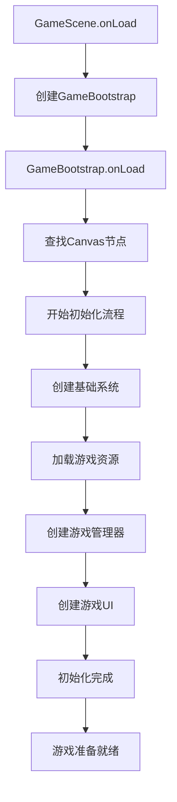

# 猫咪城堡防御游戏 - 技术架构与运行原理文档

## 项目概述

**CatProtectPlanMingame** 是一个使用 **Cocos Creator 3.8.6** 构建的猫咪城堡防御塔防游戏，采用 **TypeScript** 严格模式开发，具备完整的类型安全保障和现代化的组件架构。

### 技术栈
- **引擎**: Cocos Creator 3.8.6
- **语言**: TypeScript (严格模式)
- **架构**: 组件化架构 + 单例模式
- **目标平台**: Web、移动端
- **TypeScript配置**: ES2015 target, 实验性装饰器支持

### 项目依赖
- **Cocos Creator SDK**: 3.8.6 (包含引擎核心、组件系统、渲染管线)
- **TypeScript声明**: cc.d.ts, jsb.d.ts, cc.env.d.ts
- **无外部NPM依赖**: 纯Cocos Creator生态系统
- **平台支持**: Web、微信小游戏、原生移动平台

---

## 启动流程分析

### 1. 游戏启动顺序



### 2. 详细启动过程

#### 阶段1: 场景初始化 (`GameScene.ts`)
```typescript
protected onLoad(): void {
    console.log("=== 猫咪城堡防御游戏启动 ===");
    if (!this.gameBootstrap) {
        this.createGameBootstrap();
    }
}
```

#### 阶段2: 引导器启动 (`GameBootstrap.ts`)
```typescript
enum InitPhase {
    STARTING = "starting",
    LOADING_RESOURCES = "loading_resources", 
    CREATING_SYSTEMS = "creating_systems",
    CREATING_MANAGERS = "creating_managers",
    CREATING_UI = "creating_ui",
    COMPLETED = "completed",
    FAILED = "failed"
}
```

**初始化步骤**:
1. **创建基础系统**：ResourceManager, GridDeploymentSystem
2. **加载游戏资源**：预制体、纹理等资源
3. **创建管理器**：BattleManager, WaveManager, GameManager
4. **创建游戏UI**：GameHUD, HeroDeployment, Castle

---

## 核心架构设计

### 1. 系统层次结构

```
Canvas (根节点)
├── GameBootstrap (启动器)
├── ResourceManager (资源管理)
├── GridDeploymentSystem (网格部署)
├── BattleManager (战斗管理)
├── WaveManager (波次管理)
├── GameManager (游戏总控)
├── GameHUD (游戏界面)
├── HeroDeployment (英雄部署)
└── Castle (城堡)
```

### 2. 单例模式设计

**核心管理器均采用单例模式**:
```typescript
// GameManager单例
private static _instance: GameManager | null = null;
public static get instance(): GameManager | null {
    return GameManager._instance;
}

protected onLoad(): void {
    if (GameManager._instance) {
        console.warn("GameManager实例已存在，销毁重复实例");
        this.node.destroy();
        return;
    }
    GameManager._instance = this;
}
```

### 3. 组件缓存机制

**避免重复查找，提升性能**:
```typescript
private getCachedComponent<T extends Component>(
    cacheKey: string, 
    componentClass: new() => T
): T | null {
    const cache = (this as any)[cacheKey];
    if (cache && cache.isValid) {
        return cache;
    }
    
    const component = this.node.parent?.getComponentInChildren(componentClass) || null;
    (this as any)[cacheKey] = component;
    return component;
}
```

---

## 核心系统详解

### 1. GameManager (游戏总控制器)

**职责**:
- 游戏状态管理 (MENU, DEPLOYMENT, BATTLE, RESTING, VICTORY, GAME_OVER)
- 资源管理 (金币、城堡生命值)
- 英雄和敌人列表维护
- 游戏事件分发

**关键功能**:
```typescript
// 游戏状态枚举
enum GameState {
    MENU = "menu",
    DEPLOYMENT = "deployment",     // 部署阶段
    BATTLE = "battle",            // 战斗阶段
    RESTING = "resting",          // 休息阶段
    PLAYING = "playing",
    PAUSED = "paused",
    GAME_OVER = "game_over",
    VICTORY = "victory"
}

// 状态转换
public startBattle(): void {
    this.setGameState(GameState.BATTLE);
    const waveManager = this.getWaveManager();
    waveManager?.startWave(this.currentWave);
}
```

### 2. BattleManager (战斗系统)

**职责**:
- 战斗逻辑处理
- 目标分配算法
- 攻击计算和伤害处理
- 单位AI行为控制

**核心算法**:
```typescript
// 目标优先级计算
private calculateTargetPriority(target: BaseUnit, distance: number): number {
    let priority = 100;
    // 距离越近优先级越高
    priority -= distance * 0.1;
    // 血量越少优先级越高（便于补刀）
    const healthPercent = target.currentHealth / target.maxHealth;
    priority += (1 - healthPercent) * 20;
    return priority;
}
```

### 3. BaseUnit (基础单位类)

**所有游戏单位的基类**，提供：
- 状态机系统 (IDLE, MOVING, ATTACKING, DEAD)
- 生命值管理
- 移动和攻击逻辑
- 目标搜索算法

```typescript
export enum UnitState {
    IDLE = 0,      // 待机
    MOVING = 1,    // 移动中
    ATTACKING = 2, // 攻击中
    DEAD = 3       // 死亡
}

// 状态机更新
protected updateByState(dt: number): void {
    switch (this.unitState) {
        case UnitState.IDLE:
            this.onIdleState(dt);
            break;
        case UnitState.MOVING:
            this.onMoveState(dt);
            break;
        // ...其他状态
    }
}
```

### 4. GridDeploymentSystem (网格部署系统)

**职责**:
- 5x5网格管理 (实际为13x7网格)
- 英雄部署位置验证
- 网格坐标与世界坐标转换
- 网格状态追踪

**配置**:
```typescript
gridConfig: {
    rows: 13,        // 网格行数
    cols: 7,         // 网格列数
    cellSize: 85,    // 单元格大小
    startPosition: { x: 0, y: -200 }  // 起始位置
}
```

---

## 类型系统架构

### 1. 核心枚举定义

```typescript
// 英雄类型
export enum HeroType {
    ORANGE_CAT = "OrangeCat",      // 橘猫射手
    SIAMESE_CAT = "SiameseCat",    // 暹罗猫法师
    MAINE_CAT = "MaineCat"         // 缅因猫重炮
}

// 敌人类型
export enum EnemyType {
    BASIC_MOUSE = "BasicMouse"     // 基础老鼠
}
```

### 2. 接口设计

```typescript
// 基础单位属性
export interface UnitStats {
    readonly name: string;
    health: number;
    maxHealth: number;
    attackDamage: number;
    attackRange: number;
    attackSpeed: number;
    moveSpeed: number;
}

// 游戏事件接口
export interface GameEvents {
    'hero-deployed': { hero: Component; position: GridPosition };
    'enemy-spawned': { enemy: Component; position: WorldPosition };
    'unit-destroyed': { unit: Component; position: WorldPosition };
    'wave-completed': { wave: number };
    'game-state-changed': { newState: GameState; oldState: GameState };
}
```

---

## 数据配置系统

### 1. 英雄配置 (`GameConstants.ts`)

```typescript
export const HERO_CONFIGS: Record<HeroType, HeroConfig> = {
    [HeroType.ORANGE_CAT]: {
        type: HeroType.ORANGE_CAT,
        name: "橘猫射手",
        health: 120,
        maxHealth: 120,
        attackDamage: 25,
        attackRange: 150,
        attackSpeed: 1.2,
        moveSpeed: 100,
        cost: 50,                 // 部署费用
        bulletSpeed: 300,
        skillCooldown: 5
    }
    // ...其他英雄配置
};
```

### 2. 波次配置

```typescript
export const WAVE_CONFIGS: WaveConfig[] = [
    {
        waveNumber: 1,
        enemies: [
            { type: EnemyType.BASIC_MOUSE, count: 5, spawnDelay: 0.5 }
        ]
    }
    // ...更多波次
];
```

---

## 游戏循环与更新机制

### 1. 主更新循环

```typescript
// GameManager.update
protected update(dt: number): void {
    if (this._gameState === GameState.RESTING) {
        this.updateRestPhase(dt);
    }
}

// BattleManager.update (定时更新)
protected update(dt: number): void {
    this._updateTimer += dt;
    if (this._updateTimer >= this.battleUpdateInterval) {
        this.updateBattle(this._updateTimer);
        this._updateTimer = 0;
    }
}
```

### 2. 战斗更新逻辑

```typescript
private updateBattle(dt: number): void {
    const heroes = this._gameManager.deployedHeroes;
    const enemies = this._gameManager.activeEnemies;
    
    // 为每个英雄分配攻击目标
    for (const heroNode of heroes) {
        this.updateHeroBattle(heroNode, enemies);
    }
    
    // 处理敌人AI行为
    for (const enemyNode of enemies) {
        this.updateEnemyBattle(enemyNode, heroes);
    }
}
```

---

## 事件系统设计

### 1. 事件监听机制

```typescript
public addEventListener<K extends keyof GameEvents>(
    event: K, 
    callback: (data: GameEvents[K]) => void
): void {
    if (!this._eventCallbacks.has(event)) {
        this._eventCallbacks.set(event, []);
    }
    this._eventCallbacks.get(event)!.push(callback);
}
```

### 2. 事件分发

```typescript
private emitEvent<K extends keyof GameEvents>(event: K, data: GameEvents[K]): void {
    const callbacks = this._eventCallbacks.get(event);
    if (callbacks) {
        callbacks.forEach(callback => {
            try {
                callback(data);
            } catch (error) {
                console.error(`事件回调执行错误: ${event}`, error);
            }
        });
    }
}
```

---

## 性能优化策略

### 1. 组件缓存
- 管理器组件使用缓存避免重复查找
- 单例模式减少实例创建开销

### 2. 定时更新
- 战斗系统使用0.2秒间隔更新而非每帧更新
- 减少计算频率，提升性能

### 3. 对象池管理
- BaseUnit类提供基础的对象复用机制
- 预留对象池系统接口

### 4. 内存管理
```typescript
// 组件销毁时清理引用
protected onDestroy(): void {
    if (GameManager._instance === this) {
        GameManager._instance = null;
    }
}
```

---

## 扩展性设计

### 1. 英雄系统扩展
- 基于HeroType枚举和配置文件
- 通过继承BaseUnit实现新英雄
- 支持技能系统扩展

### 2. 敌人系统扩展
- EnemyType枚举支持新敌人类型
- ENEMY_CONFIGS配置新敌人属性
- AI行为可独立扩展

### 3. UI系统扩展
- 组件化UI设计
- 基于Graphics API的代码驱动UI
- 支持动态界面创建

---

## 调试和开发工具

### 1. 日志系统
```typescript
private log(message: string, ...args: any[]): void {
    if (this.enableDebugLogs) {
        console.log(`[GameBootstrap] ${message}`, ...args);
    }
}
```

### 2. 状态监控
```typescript
public getGameStats(): {
    wave: number;
    gold: number;
    castleHealth: number;
    castleHealthPercent: number;
    heroesCount: number;
    enemiesCount: number;
    gameState: GameState;
}
```

---

## TypeScript配置与编译

### 1. TypeScript编译配置

**主配置文件** (`tsconfig.json`):
```json
{
  "extends": "./temp/tsconfig.cocos.json",
  "compilerOptions": {
    "strict": false  // 项目设置为非严格模式，但CLAUDE.md要求严格模式
  }
}
```

**Cocos Creator自动生成配置** (`temp/tsconfig.cocos.json`):
```json
{
  "compilerOptions": {
    "target": "ES2015",           // 编译目标ES2015
    "module": "ES2015",           // 模块系统ES2015
    "strict": true,               // 严格类型检查
    "experimentalDecorators": true, // 支持装饰器语法
    "isolatedModules": true,      // 每个文件作为单独模块
    "moduleResolution": "node",   // Node.js模块解析
    "noEmit": true,              // 不生成输出文件
    "forceConsistentCasingInFileNames": true
  }
}
```

### 2. 路径映射系统

```json
"paths": {
  "db://internal/*": [
    "/Applications/Cocos/Creator/3.8.6/CocosCreator.app/Contents/Resources/resources/3d/engine/editor/assets/*"
  ],
  "db://assets/*": [
    "/Users/shiyuanchen/Project/CatProtectPlanMingame/assets/*"
  ]
}
```

### 3. 类型声明引入

```json
"types": [
  "./temp/declarations/cc.custom-macro",  // 自定义宏定义
  "./temp/declarations/cc",               // Cocos Creator引擎类型
  "./temp/declarations/jsb",              // JSB桥接类型
  "./temp/declarations/cc.env"            // 环境类型
]
```

---

## 构建与部署流程

### 1. 开发模式
- **预览运行**: Cocos Creator内置浏览器预览
- **热重载**: 支持代码修改后自动刷新
- **调试模式**: DevTools集成调试

### 2. 构建流程
1. **TypeScript编译**: 自动转换为JavaScript
2. **资源打包**: 纹理、音频、场景等资源优化
3. **代码压缩**: UglifyJS压缩优化
4. **平台适配**: 根据目标平台生成不同构建

### 3. 目标平台
- **Web**: HTML5浏览器运行
- **微信小游戏**: 微信生态内运行
- **原生iOS/Android**: 通过JSB桥接原生功能

---

## 文件组织结构详解

### 1. 核心目录结构
```
CatProtectPlanMingame/
├── assets/                 # 游戏资源目录
│   ├── scripts/           # TypeScript源码
│   ├── scenes/            # 场景文件
│   ├── textures/          # 图片资源
│   └── animations/        # 动画资源
├── library/               # Cocos Creator库文件缓存
├── temp/                  # 临时文件和编译缓存
│   ├── tsconfig.cocos.json
│   └── declarations/      # TypeScript类型声明
├── build/                 # 构建输出目录
├── docs/                  # 项目文档
├── package.json           # Cocos Creator项目配置
└── tsconfig.json          # TypeScript配置
```

### 2. scripts目录结构详解
```
scripts/
├── GameScene.ts           # 主场景控制器
├── components/            # 游戏组件
│   ├── base/             # 基础组件
│   ├── heroes/           # 英雄组件
│   ├── enemies/          # 敌人组件
│   ├── game/             # 游戏对象
│   └── ui/               # UI组件
├── managers/             # 管理器类
├── systems/              # 系统类
├── types/                # 类型定义
└── utils/                # 工具类
```

### 3. 代码组织原则
- **单一职责**: 每个文件专注单一功能
- **模块化**: 清晰的导入/导出关系
- **类型安全**: 完整的TypeScript类型定义
- **可维护性**: 良好的注释和文档

---

## 开发工作流程

### 1. 开发环境启动
1. 使用Cocos Creator 3.8.6打开项目
2. 选择场景文件 `assets/scenes/scene.scene`
3. 点击预览按钮启动开发服务器
4. 在浏览器中查看游戏运行效果

### 2. 代码开发流程
1. **编写TypeScript代码**: 在 `assets/scripts/` 目录
2. **类型检查**: 编辑器实时类型检查
3. **热重载测试**: 保存后自动刷新预览
4. **调试**: 使用浏览器DevTools调试

### 3. 资源管理
- **图片资源**: 放入 `assets/textures/`
- **动画资源**: 放入 `assets/animations/`
- **音频资源**: 按需添加到对应目录
- **场景文件**: Cocos Creator编辑器管理

---

## 总结

这个项目采用了现代化的TypeScript + Cocos Creator架构，具备以下特点：

### 优势
1. **类型安全**: 严格的TypeScript类型系统
2. **架构清晰**: 单一职责原则，组件化设计
3. **性能优化**: 缓存机制、定时更新、对象池预留
4. **可扩展性**: 配置驱动、接口设计良好
5. **调试友好**: 完整的日志系统和状态监控

### 技术亮点
- 完整的游戏状态机设计
- 基于优先级的战斗目标分配算法
- 网格化的部署系统
- 事件驱动的架构
- 代码驱动的UI系统

这是一个高质量的现代化游戏架构，为后续功能扩展和维护提供了坚实的基础。